# ImmigrationGPT - Agent & Technology Flow Diagram

## Simplified Architecture View

```mermaid
flowchart TD
    %% User Interface
    USER[👤 User]
    
    %% Frontend Stack
    subgraph "Frontend (Next.js + React)"
        UI[Chat Interface]
        STATE[Zustand Store]
        API[Axios Client]
    end
    
    %% Backend Stack
    subgraph "Backend (FastAPI)"
        SERVER[FastAPI Server]
        ENDPOINTS[API Endpoints<br/>/chat, /health, /settings]
    end
    
    %% AI Agent System
    subgraph "AI Agent System (LangGraph)"
        SUPERVISOR[🎯 Supervisor Agent<br/>Decides which agent to use]
        
        subgraph "Specialized Agents"
            RAG_AGENT[📚 RAG Agent<br/>Document-based answers]
            WEB_AGENT[🌐 Web Search Agent<br/>Current information]
        end
        
        WORKFLOW[StateGraph Workflow<br/>Orchestrates agent execution]
    end
    
    %% AI Tools & Models
    subgraph "AI Tools & Models"
        OPENAI_MODEL[🤖 OpenAI GPT-4o-mini<br/>Language Generation]
        EMBEDDINGS[🧠 OpenAI Embeddings<br/>Text Vectorization]
        RAG_TOOL[📖 RAG Tool<br/>Document Retrieval]
        SEARCH_TOOL[🔍 Tavily Search Tool<br/>Web Search]
    end
    
    %% Data Layer
    subgraph "Data & Storage"
        VECTOR_DB[🗄️ Qdrant Vector Store<br/>Document embeddings]
        PDF_DOCS[📄 Immigration PDFs<br/>Policy documents]
        CHUNKS[📝 Text Chunks<br/>Processed documents]
    end
    
    %% External Services
    subgraph "External APIs"
        OPENAI_API[OpenAI API]
        TAVILY_API[Tavily Search API]
        GOV_SITES[Government Sites<br/>USCIS, Immigration Forum]
    end
    
    %% Main Flow
    USER --> UI
    UI --> STATE
    UI --> API
    API --> SERVER
    SERVER --> ENDPOINTS
    ENDPOINTS --> SUPERVISOR
    
    %% Agent Flow
    SUPERVISOR --> WORKFLOW
    WORKFLOW --> RAG_AGENT
    WORKFLOW --> WEB_AGENT
    
    %% Tool Usage
    RAG_AGENT --> RAG_TOOL
    WEB_AGENT --> SEARCH_TOOL
    
    %% AI Processing
    RAG_TOOL --> VECTOR_DB
    RAG_TOOL --> EMBEDDINGS
    SEARCH_TOOL --> TAVILY_API
    
    %% Data Processing
    VECTOR_DB --> CHUNKS
    CHUNKS --> PDF_DOCS
    EMBEDDINGS --> OPENAI_API
    
    %% External Connections
    TAVILY_API --> GOV_SITES
    OPENAI_MODEL --> OPENAI_API
    
    %% Response Flow
    OPENAI_MODEL --> WORKFLOW
    WORKFLOW --> SUPERVISOR
    SUPERVISOR --> ENDPOINTS
    ENDPOINTS --> API
    API --> UI
    UI --> USER
    
    %% Styling
    classDef user fill:#e3f2fd
    classDef frontend fill:#f3e5f5
    classDef backend fill:#e8f5e8
    classDef agents fill:#fff3e0
    classDef tools fill:#fce4ec
    classDef data fill:#f1f8e9
    classDef external fill:#fff8e1
    
    class USER user
    class UI,STATE,API frontend
    class SERVER,ENDPOINTS backend
    class SUPERVISOR,RAG_AGENT,WEB_AGENT,WORKFLOW agents
    class OPENAI_MODEL,EMBEDDINGS,RAG_TOOL,SEARCH_TOOL tools
    class VECTOR_DB,PDF_DOCS,CHUNKS data
    class OPENAI_API,TAVILY_API,GOV_SITES external
```

## Agent Decision Flow

```mermaid
flowchart LR
    QUERY[User Query] --> SUPERVISOR{Supervisor Agent<br/>Analyzes Query}
    
    SUPERVISOR -->|Document-based<br/>Policy Questions| RAG_PATH[📚 RAG Agent Path]
    SUPERVISOR -->|Current Events<br/>Recent Updates| WEB_PATH[🌐 Web Search Path]
    
    RAG_PATH --> RAG_TOOL[Document Retrieval]
    WEB_PATH --> WEB_TOOL[Web Search]
    
    RAG_TOOL --> VECTOR_SEARCH[Vector Search<br/>in Qdrant]
    WEB_TOOL --> EXTERNAL_SEARCH[Search USCIS<br/>Immigration Sites]
    
    VECTOR_SEARCH --> CONTEXT[Retrieved Context]
    EXTERNAL_SEARCH --> CURRENT_INFO[Current Information]
    
    CONTEXT --> LLM[OpenAI GPT-4o-mini<br/>Generate Response]
    CURRENT_INFO --> LLM
    
    LLM --> RESPONSE[Final Answer]
    
    classDef decision fill:#fff3e0
    classDef path fill:#e8f5e8
    classDef tool fill:#fce4ec
    classDef result fill:#e3f2fd
    
    class SUPERVISOR decision
    class RAG_PATH,WEB_PATH path
    class RAG_TOOL,WEB_TOOL,VECTOR_SEARCH,EXTERNAL_SEARCH tool
    class CONTEXT,CURRENT_INFO,LLM,RESPONSE result
```

## Technology Integration Points

### Frontend ↔ Backend
- **Protocol**: HTTP/HTTPS
- **Format**: JSON
- **Client**: Axios
- **Endpoints**: `/chat`, `/health`, `/settings`

### Backend ↔ AI System
- **Framework**: LangGraph StateGraph
- **Communication**: Direct method calls
- **State Management**: TypedDict with message history

### AI System ↔ External Services
- **OpenAI**: REST API for GPT-4o-mini and embeddings
- **Tavily**: REST API for web search
- **Qdrant**: In-memory vector operations

### Data Processing Pipeline
1. **PDF Loading**: PyMuPDF extracts text
2. **Text Splitting**: RecursiveCharacterTextSplitter creates chunks
3. **Embedding**: OpenAI embeddings vectorize chunks
4. **Storage**: Qdrant stores vectors in-memory
5. **Retrieval**: Similarity search returns relevant chunks
