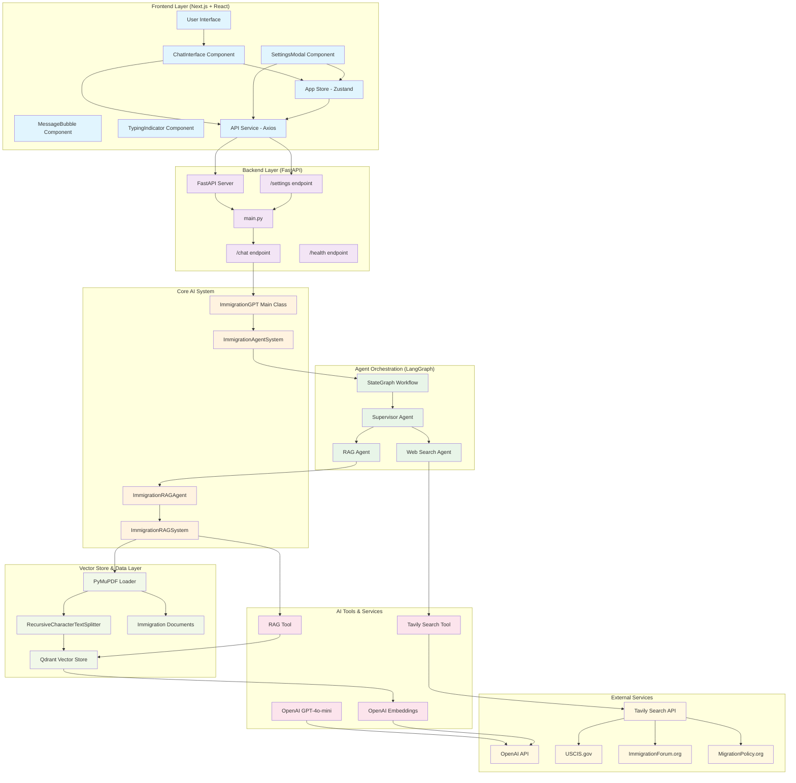

# ImmigrationGPT Application Architecture

## System Overview
This diagram shows the complete architecture of the ImmigrationGPT application, including frontend, backend, AI agents, and external services. 

## Technology Stack

### Frontend Technologies
- **Next.js 14** - React framework
- **React 18** - UI library
- **TypeScript** - Type safety
- **Tailwind CSS** - Styling
- **Framer Motion** - Animations
- **Zustand** - State management
- **Axios** - HTTP client
- **React Markdown** - Markdown rendering
- **React Hot Toast** - Notifications

### Backend Technologies
- **FastAPI** - Web framework
- **Uvicorn** - ASGI server
- **Pydantic** - Data validation
- **Python-dotenv** - Environment management

### AI & ML Technologies
- **LangChain** - LLM framework
- **LangGraph** - Agent orchestration
- **OpenAI GPT-4o-mini** - Language model
- **OpenAI Embeddings** - Text embeddings
- **Qdrant** - Vector database
- **Tavily Search** - Web search API

### Document Processing
- **PyMuPDF** - PDF processing
- **RecursiveCharacterTextSplitter** - Text chunking

## Data Flow

1. **User Input**: User types a message in the chat interface
2. **Frontend Processing**: Message is sent via Axios to the FastAPI backend
3. **Backend Routing**: FastAPI routes the request to the chat endpoint
4. **Agent Orchestration**: LangGraph supervisor decides which agent to use
5. **Agent Execution**: Either RAG agent or Web Search agent processes the query
6. **Tool Usage**: Agents use their respective tools (RAG or Tavily search)
7. **Response Generation**: OpenAI generates the final response
8. **Response Return**: Response flows back through the system to the user

## Key Features

- **Multi-Agent System**: RAG agent for document-based queries, Web agent for current information
- **Vector Search**: Qdrant vector store for semantic document retrieval
- **Real-time Chat**: WebSocket-like experience with typing indicators
- **Settings Management**: API key configuration through the UI
- **Conversation History**: Persistent chat history using Zustand
- **Error Handling**: Comprehensive error handling throughout the stack
